<div align="center">

# 🌧️ MONSOON AI
### Regime-Aware Rainfall Intelligence

[](https://reactjs.org/)
[](https://www.typescriptlang.org/)
[](https://vitejs.dev/)
[](https://tailwindcss.com/)
[](https://www.ncmrwf.gov.in/)
[](#)

<p align="center">
  <b>Regime-Aware AI Post-Processing of Numerical Weather Prediction (NWP) Monsoon Rainfall Forecasts</b><br />
  Ministry of Earth Sciences (MoES) • National Centre for Medium Range Weather Forecasting (NCMRWF)
</p>

</div>

---

## 📌 Executive Summary

Numerical Weather Prediction (NWP) models (such as the NCMRWF Unified Model **NCUM** and IMD-GFS) provide vital guidance for the Indian Summer Monsoon. However, raw dynamical model forecasts systematically suffer from convective parameterization biases—underestimating extreme downpours along mountain barriers and coastal troughs while producing spurious precipitation over rainshadow corridors.

**Monsoon AI** implements a **Regime-Aware Deep Learning Post-Processing Architecture** that dynamically conditions spatial bias correction on prevailing synoptic weather regimes. By classifying atmospheric patterns into distinct physical regimes (Active Trough, Break, Depression, Coastal Vortex, Orographic Uplift, and Western Disturbance), the system achieves an average **74.6% bias reduction** and improves heavy precipitation detection ($POD \ge 64.5\text{ mm}$) by **+23.8%**.

---

## 🌟 Key Features & Capabilities

### 1. 🗺️ High-Resolution India Rainfall Intelligence Map
- **Custom Meteorological Raster Contours**: Accurate spatial interpolation capturing the intense coastal downpours along the Andhra/Odisha coast ($\ge 200\text{ mm}$), the active monsoon trough over Central India ($50\text{--}100\text{ mm}$), and Western Ghats orographic enhancements.
- **Dynamic Layer Switching**: Instant toggle between:
  - `Raw NWP`: Baseline uncorrected dynamical forecast.
  - `AI Corrected`: Post-processed precipitation field.
  - `Difference`: Spatial bias correction anomaly map ($+$ / $-$ mm).
  - `Probability`: Calibrated exceedance probability ($\ge 64.5\text{ mm}$).
  - `Regime`: Synoptic feature overlay (Monsoon Trough axis, Offshore trough, Bay of Bengal Low).
- **Interactive District Anchors**: Floating information cards (e.g., Bhopal, Mumbai, Indore, Dehradun) displaying raw vs. corrected rainfall, exceedance probability, and confidence score with single-click inspection.

### 2. 🌀 Synoptic Weather Regime Classification
- Real-time classification into 6 physical monsoon regimes:
  1. **Active Monsoon** ($87.4\%$ confidence): Strong low-level jet $>35\text{ kts}$, deep trough over central plains.
  2. **Break Monsoon**: Trough shifted north to Himalayan foothills; subdued central peninsular rain.
  3. **Monsoon Depression**: Low pressure vortices propagating inland from Bay of Bengal.
  4. **Coastal Monsoon**: Offshore trough along Konkan and Malabar coast with high diurnal convection.
  5. **Orographic Heavy**: Windward mountain slope precipitation enhancement (Western Ghats, Meghalaya).
  6. **Western Disturbance**: Extratropical mid-tropospheric trough interactions over Northwest India.

### 3. 📈 Multi-Lead NWP vs. AI Correction Analytics
- Lead time progression across $6\text{h}$, $12\text{h}$, $24\text{h}$, $36\text{h}$, $48\text{h}$, and $72\text{h}$ horizons.
- Comparative line charts tracking **Raw NWP**, **AI Corrected**, and **Observed** rainfall.
- Key bias metrics:
  - **Raw NWP Bias**: $+28.4\text{ mm}$
  - **AI Bias**: $+7.2\text{ mm}$
  - **Bias Reduction**: $74.6\%$

### 4. ⚠️ Heavy Rainfall Early Warning System
- Standard IMD Rainfall Thresholds:
  - **Moderate**: $15.6\text{ -- }64.4\text{ mm}$ (Green Advisory)
  - **Heavy**: $64.5\text{ -- }115.5\text{ mm}$ (Yellow Warning)
  - **Very Heavy**: $115.6\text{ -- }204.4\text{ mm}$ (Orange Alert)
  - **Extremely Heavy**: $\ge 204.5\text{ mm}$ (Red Alert)
- Live advisory feed with automated NDMA incident dispatch recommendations.

### 5. 🔍 Explainable AI (XAI) Attribution
- Transparent factor breakdown explaining why the AI altered the raw NWP forecast:
  - **Weather Regime Dynamics**: $42\%$
  - **Historical Model Bias**: $28\%$
  - **Moisture Flux Convergence**: $14\%$
  - **Topographic Uplift (DEM)**: $10\%$
  - **Residual Microphysics**: $6\%$

### 6. 📊 Objective Statistical Verification
Evaluated against high-resolution IMD gridded observation datasets ($0.25^\circ \times 0.25^\circ$):
| Metric | Full Name | Raw NWP | AI Corrected | Improvement |
| :--- | :--- | :---: | :---: | :---: |
| **RMSE** | Root Mean Squared Error | $42.8\text{ mm}$ | **$29.7\text{ mm}$** | **$-30.6\%$** |
| **CSI** | Critical Success Index | $0.42$ | **$0.61$** | **$+45.2\%$** |
| **ETS** | Equitable Threat Score | $0.31$ | **$0.48$** | **$+54.8\%$** |
| **POD** | Probability of Detection | $0.63$ | **$0.78$** | **$+23.8\%$** |
| **FAR** | False Alarm Ratio | $0.29$ | **$0.18$** | **$-37.9\%$** |
| **FSS** | Fractions Skill Score | $0.44$ | **$0.67$** | **$+52.3\%$** |

---

## 🔄 AI Post-Processing Pipeline

```mermaid
flowchart LR
    A["01 RAW NWP<br/>NCUM / IMD-GFS"] --> B["02 REGIME DETECTION<br/>Synoptic Wind & Vorticity"]
    B --> C["03 REGIME CLASSIFICATION<br/>Active / Break / Depression"]
    C --> D["04 REGIME MODEL<br/>Conditioned Attention"]
    D --> E["05 BIAS CORRECTION<br/>Spatial Non-Linear Residuals"]
    E --> F["06 HEAVY RAIN PROB.<br/>Calibrated Exceedance"]
    F --> G["07 DISTRICT FORECAST<br/>700+ District Advisories"]

    style A fill:#EBF4FE,stroke:#75B8F5,stroke-width:1.5px
    style B fill:#E6F8FA,stroke:#70CBD5,stroke-width:1.5px
    style C fill:#F4F9E4,stroke:#B8D957,stroke-width:1.5px
    style D fill:#EBF4FE,stroke:#2563EB,stroke-width:1.5px
    style E fill:#FEF4E8,stroke:#F4B860,stroke-width:1.5px
    style F fill:#FDECE9,stroke:#E98276,stroke-width:1.5px
    style G fill:#FAFAF8,stroke:#171717,stroke-width:1.5px
```



---

## 🎨 UI/UX Design System

The frontend recreates a **clean, light, analytical dashboard**:
- **Background**: `#F5F5F3` (Very light neutral gray / off-white)
- **Cards**: `#FFFFFF` with soft borders (`#E7E7E3`) and `rounded-2xl` / `rounded-3xl` radii.
- **Accents**:
  - Lime Green: `#B8D957` (Active Regime & High Confidence)
  - Soft Blue: `#75B8F5` (Hydrological & NWP Data)
  - Cyan: `#70CBD5` (Regime Moisture Flux)
  - Warm Yellow: `#F4D35E` (Moderate Warning)
  - Soft Orange: `#F4B860` (Heavy Rainfall Advisory)
  - Soft Coral Red: `#E98276` (Severe Exceedance Alert)
- **Contrast Widget**: Elegantly isolated dark charcoal card (`#18191B`) reserved exclusively for the *Rainfall Alerts* component to create balanced visual hierarchy.

---

## 📂 Project Architecture

```
sih-ps80/
├── public/                     # Static assets & favicon
├── src/
│   ├── components/
│   │   ├── dashboard/          # Centerpiece dashboard cards
│   │   │   ├── AiExplanationCard.tsx       # SHAP factor attribution widget
│   │   │   ├── AiPipelineCard.tsx          # 7-step connected workflow
│   │   │   ├── BottomWidgets.tsx           # Model, Data Sources & System Status
│   │   │   ├── DistrictForecastTable.tsx   # Searchable & filterable district table
│   │   │   ├── ForecastAccuracyCard.tsx    # Multi-lead RMSE vertical bar chart
│   │   │   ├── HeavyRainfallRiskCard.tsx   # Donut gauge for exceedance probability
│   │   │   ├── IndiaRainfallMap.tsx        # Canvas & SVG meteorological map
│   │   │   ├── NwpVsAiChartCard.tsx        # Multi-lead time series comparison
│   │   │   ├── RainfallAlertsCard.tsx      # Dark contrast alerts widget
│   │   │   ├── TopMetrics.tsx              # 5 top key performance metric cards
│   │   │   └── WeatherRegimeCard.tsx       # Active regime breakdown & progress bars
│   │   ├── layout/
│   │   │   ├── Header.tsx                  # Search bar, date, cycle & demo mode
│   │   │   └── Sidebar.tsx                 # Navigation with status beacon
│   │   ├── modals/
│   │   │   └── DistrictDetailModal.tsx     # District bulletin & advisory modal
│   │   └── views/                          # Dedicated sub-views
│   │       ├── DataSourcesView.tsx         # Sensor & NWP feed telemetry
│   │       ├── DistrictsView.tsx           # 700+ district search & filter
│   │       ├── ForecastView.tsx            # Multi-horizon grid progression
│   │       ├── HeavyRainfallView.tsx       # IMD threshold risk assessment
│   │       ├── ModelPerformanceView.tsx    # ConvLSTM & Transformer benchmarks
│   │       ├── SettingsView.tsx            # Cycles, thresholds & demo toggles
│   │       ├── VerificationView.tsx        # Contingency tables & skill metrics
│   │       └── WeatherRegimesView.tsx      # Synoptic regime physics encyclopedia
│   ├── data/
│   │   └── mockData.ts         # High-fidelity meteorological simulation dataset
│   ├── types/
│   │   └── index.ts            # Strict TypeScript interfaces & definitions
│   ├── App.tsx                 # Master layout & state management
│   ├── index.css               # Tailwind directives & typography styling
│   └── main.tsx                # React entry point
├── package.json
├── tailwind.config.js          # Custom color palette & radii specifications
├── tsconfig.json
└── vite.config.ts
```

---

## ⚡ Tech Stack

- **Framework**: [React 18.3](https://reactjs.org/) + [TypeScript](https://www.typescriptlang.org/)
- **Bundler & Tooling**: [Vite 6](https://vitejs.dev/)
- **Styling**: [Tailwind CSS 3.4](https://tailwindcss.com/)
- **Visualizations**: [Recharts](https://recharts.org/) + Custom HTML5 Canvas & SVG Raster Interpolation
- **Icons**: [Lucide React](https://lucide.dev/)
- **Typography**: Plus Jakarta Sans & Inter

---

## 🚀 Getting Started

### Prerequisites
- Node.js `v18.0` or later
- npm or yarn

### 1. Clone the repository
```bash
git clone https://github.com/your-username/monsoon-ai.git
cd monsoon-ai
```

### 2. Install dependencies
```bash
npm install
```

### 3. Start development server
```bash
npm run dev
```
Open your browser at `http://localhost:5173/` to view the live dashboard.

### 4. Build for production
```bash
npm run build
```
Generates an optimized production bundle in the `dist/` directory.

---

## ⚠️ Disclaimer

> **Prototype Demonstration**: Forecast values, regime classifications, and verification metrics presented in this application are simulated for demonstration and prototyping purposes. They do not constitute official operational weather forecasts of the **Ministry of Earth Sciences (MoES)** or the **National Centre for Medium Range Weather Forecasting (NCMRWF)**.
